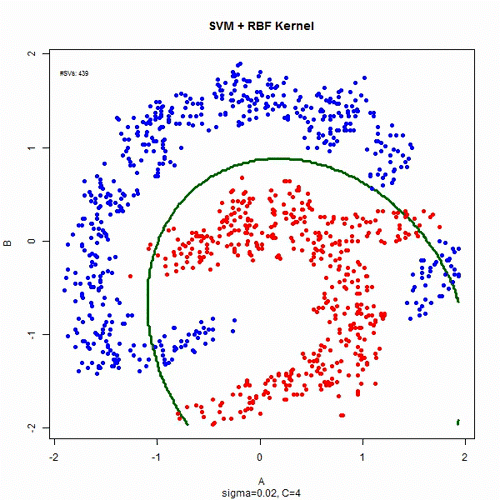

   
 

## Course Description
Welcome ! You just found the repository of resource materials for  
<b> Artificial Intelligence (CSE-411) </b>  & 
<b> Computer Vision & Robotics (CSE-437) </b> 
courses offered by MIU at Summer 2020 trimester.  

## Course Outline
 <a href="./CSE-411/course_outline_ai.pdf">[CSE-411]</a>  <a href="./CSE-437/course_outline_cv.pdf">[CSE-437]</a>

## Course Discussion
For any academic questions ask <a href="https://github.com/Mahedi-61/Summer-2020/issues/new">here</a>  
Give your anonymous feedback <a href="https://forms.gle/JzxMGb3VfQLDR9Px8">here</a>

## Course Project Details
* Coming soon !!

## Announcement  
* [19/06/2020]: Due to the COVID-19 pandemic situtation all of the classes of these courses, henceforth, are going to be condcuted in online. Contact respective CRs for time & connection.